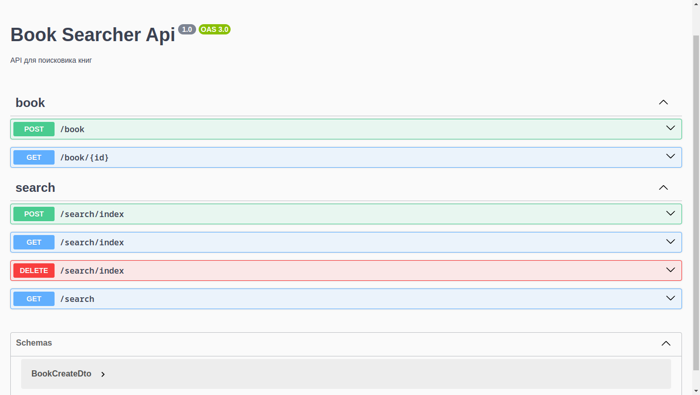

# Backend

## Стэк

Тут рассматриваются следующие технологий:

- Nest.JS
- i18n
- PostgreSQL
- PrismaORM
- Базовые возможности ElasticSearch
- Документирование API

## Как посмотреть API?

Сначала запустить `docker compose`, затем перейти в браузере по [пути](http://localhost:3000/api), где уже будет `11640` книг которые были спаршены [парсером](scraper/README.md).

### DEMO:

